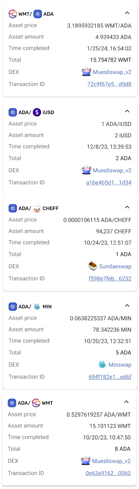
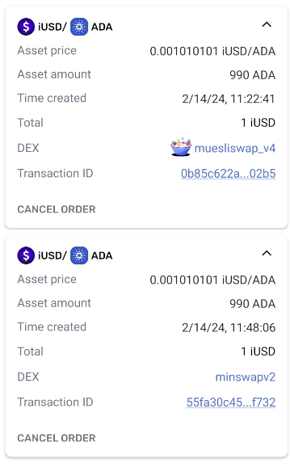

# Orders examples

## Completed orders

A few examples of responses for the same wallet with 5 orders completed.

Orders are:

1. WMT/ADA 72c9f67e5 b8aa4314dc
2. ADA/iUSD a1be4b5d1 0e10dacea8e
3. ADA/CHEFF f598e7feb d81018d578
4. ADA/MIN 694f182e1 9cc6940476ed
5. ADA/WMT 0e63a9162 9381d237a3d

- **dh-orders.json**: Response from Dexhunter. Minswap (4th) transaction is missing
- **os-orders.json**: Response from Openswap, only Muesliswap tx orders show (missing Minswap and Sundaeswap). Could be because of params in getCompletedOrders, `matched` and `v2_only`?
- **tx-orders.json**: CURRENTLY IN USE. Filtered from transactions directly from the wallet, shows all 5 orders.
- **tx-orders-expanded.json**: Same as tx-orders, but adding send and receive tx data

## Open orders

1. iUSD/ADA 0b85c622a -
2. iUSD/ADA 55fa30c45 -

- **dh-pending.json**: Response from Dexhunter immediately after placing the order. After some time it becomes `[]` and the order is shown as LIMIT
- **dh-limit.json**: Reponse from Dexhunter for the limit (not fulfilled) orders. Minswap still missing
- **os-pending.json**: CURRENTLY IN USE Response from Openswap, this uses a different endpoint (that probably shouldn't be used) than the completed orders.

## Openswap new endpoints

- os-aggregator.js: Orders agreggator endpoint returns the missing minswap order
- os-v2 and noparams: Returns open orders only from muesliswap
- os-v3.js: History endpoint returns all completed orders
